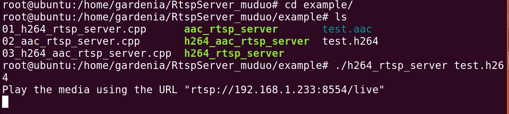
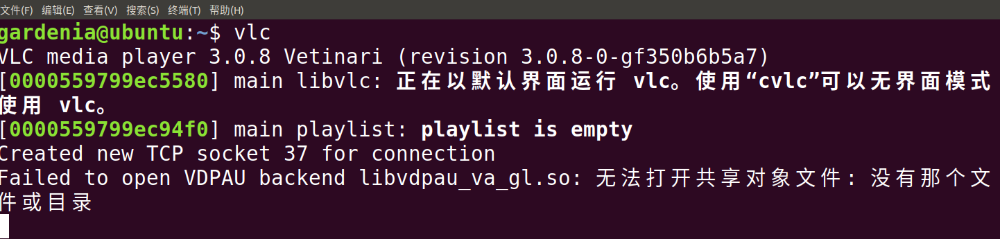
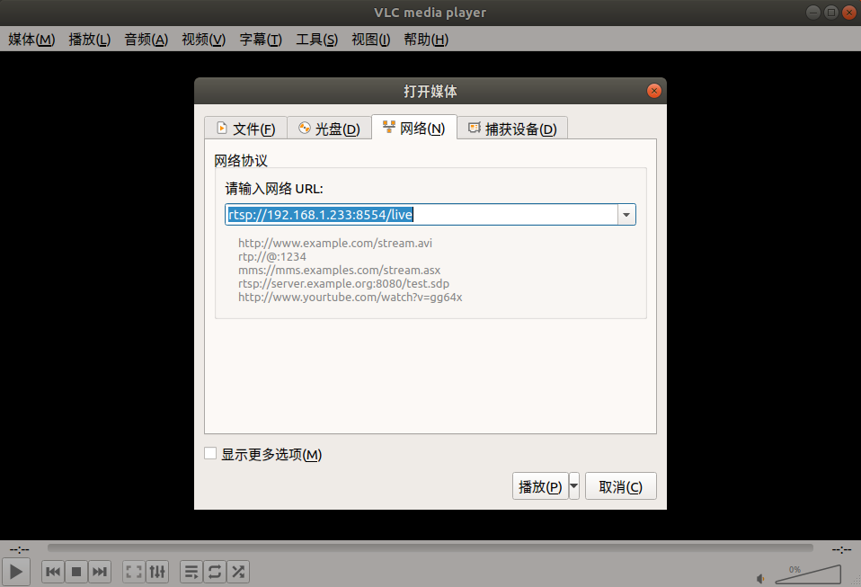
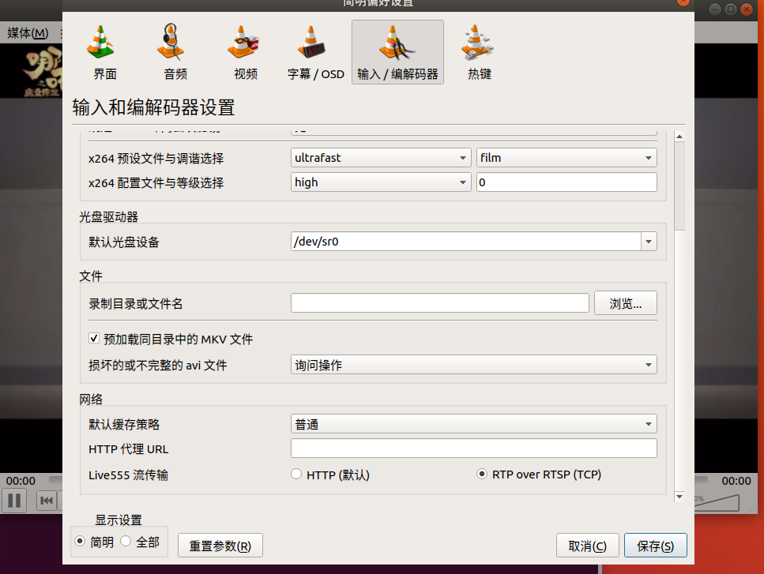

# RtspServer

## 一、项目介绍

- 使用C++实现的一个RTSP服务器

## 二、功能介绍

- 支持H264、AAC的音视频格式
- 支持传输H264格式的视频文件和AAC格式的音频文件
- 支持同时传输音视频

## 三、开发环境

- 系统：Ubuntu 18.04
- 编译工具：gcc 7.5.0

## 四、使用方法

提供示例：传输H.264文件、传输AAC文件、同时传输H.264和AAC文件

### 4.1 传输音视频文件

- 下载

  ```
  #git@github.com:GardeniaWhite/RtspServer.git
  ```

- 编译

  ```c
  # cd RtspServer/
  # make
  ```

  编译之后在`example/`目录下会生成`h264_rtsp_server`、`aac_rtsp_server`、`h264_aac_rtsp_server`

  **h264_rtsp_server**：传输H.264格式的视频文件

  **aac_rtsp_server**：传输AAC格式的音频文件

  **h264_aac_rtsp_server**：同时传输音视频


- 运行`h264_rtsp_server`

  进入`example`目录

  ```
  # cd example/
  ```

  运行`h264_rtsp_server`

  ```
  # ./h264_rtsp_server test.h264
  ```


  运行后会出现一行提示，其中url会随主机的ip改变

  ```
  Play the media using the URL "rtsp://192.168.1.233:8554/live"
  ```
  打开一个新终端窗口，输入
  ```
  vlc
  ```


  就可以打开vlc（在这之前要保证vlc已经安装），输入url，点击播放即可看到视频。

  

- 效果
  

- 运行`aac_rtsp_server`

  ```
  # ./aac_rtsp_server test.aac
  ```

- 运行`h264_aac_rtsp_server`

  ```
  # ./h264_aac_rtsp_server test.h264 test.aac
  ```

### 4.2 RTP_OVER_RTSP

此项目默认时采用RTP_OVER_UDP，支持RTP_OVER_RTSP，如果需要测试，那么就需要设置vlc

`工具`>>`首选项`>>`输入/编解码器`>>`live555 流传输`>>`RTP over RTSP(TCP)`



然后随便运行一个example，在vlc输入url，此时就是使用RTP_OVER_RTSP

### 4.3 多播

如果想测试多播，就需要修改example的示例

打开任意一个示例，将其中

```
//session->startMulticast();
```

这段屏蔽打开，然后重新编译运行，即可切换到多播

## 五、技术点

该项目参考了muduo网络库和live555

- 服务器模型

  非阻塞IO，采用Reactor模型。使用线程池处理计算量比较大的任务（音视频文件处理，音视频数据采集与编码）

- IO多路复用

  支持select、poll、epoll

- 定时器

  通过Linux提供的定时器`timerfd_create `，将定时器文件描述符作为一个事件交给Reactor，定时器队列采用`multimap`管理超时时间

- 日志

  日志实现了前后端分离，前端负责格式化字符串然后发送给后端，后端启动一个线程，服务将数据写入磁盘中，使用了双缓冲技术