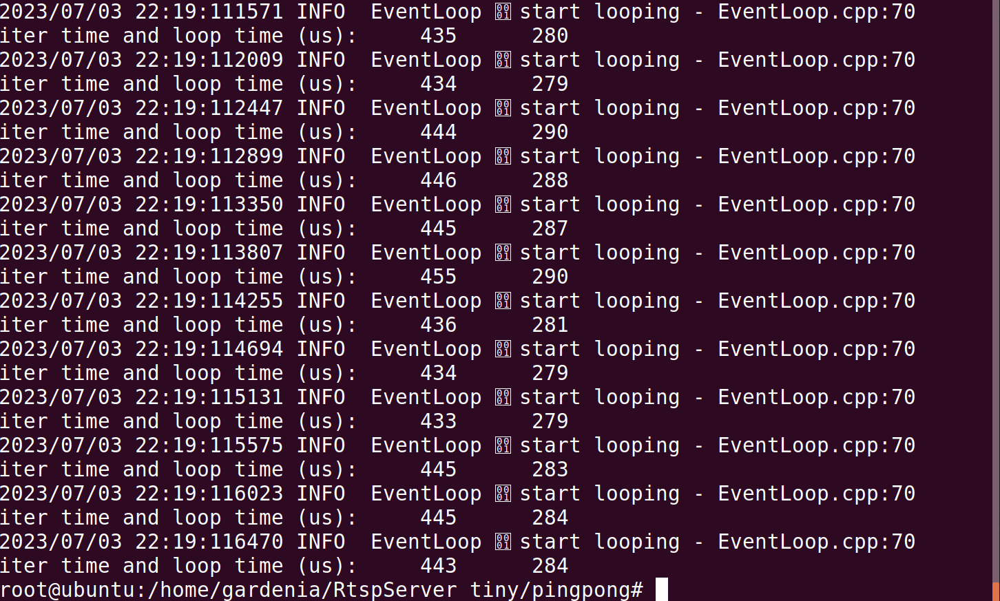

# Tiny_muduo Network Library


## 项目介绍

本项目是参考 muduo 实现的基于 Reactor 模型的多线程网络库。使用 C++ 11 编写去除 muduo 对 boost 的依赖，内部实现了一个小型的 HTTP 服务器，可支持 GET 请求和静态资源的访问，且附有异步日志监控服务端情况。

项目已经实现了 Channel 模块、Poller 模块、事件循环模块、HTTP 模块、定时器模块、异步日志模块。  

## 项目功能
头文件生成至目录`/usr/include/tinymuduo/`，`.so`库文件生成至目录`/usr/lib/`。
1. EventLoop.*`、`Channel.*`、`Poller.*`、`EPollPoller.*`等主要用于事件轮询检测，并实现了事件分发处理的底层实现方法。`EventLoop`负责轮询执行`Poller`，要进行读、写、错误、关闭等事件时需执行哪些回调函数，均绑定至`Channel`中，只需从中调用即可，事件发生后进行相应的回调处理即可
2. `Thread.*`、`EventLoopThread.*`、`EventLoopThreadPool.*`等将线程和`EventLoop`事件轮询绑定在一起，实现真正意义上的`one loop per thread`
3. `TcpServer.*`、`TcpConnection.*`、`Acceptor.*`、`Socket.*`等是`mainloop`对网络连接的响应并轮询分发至各个`subloop`的实现，其中注册大量回调函数
4. `Buffer.*`为`muduo`网络库自行设计的自动扩容的缓冲区，保证数据有序性到达


## 项目特点

1. 底层使用 Epoll + LT 模式的 I/O 复用模型，并且结合非阻塞 I/O  实现主从 Reactor 模型。采用`Reactor`模型和多线程结合的方式，实现了高并发非阻塞网络库。
2. 采用「one loop per thread」线程模型，并向上封装线程池避免线程创建和销毁带来的性能开销。
3. 采用 eventfd 作为事件通知描述符，方便高效派发事件到其他线程执行异步任务。EventLoop`中使用了`eventfd`来调用`wakeup()`，让`mainloop`唤醒`subloop`的`epoll_wait`阻塞。
4. 在`EventLoop`中注册回调`cb`至`pendingFunctors_`，并在`doPendingFunctors`中通过`swap()`的方式，快速换出注册的回调，只在`swap()`时加锁，减少代码临界区长度，提升效率。（若不通过`swap()`的方式去处理，而是加锁执行`pendingFunctors`中的回调，然后解锁，会出现什么问题呢？1. 临界区过大，锁降低了服务器响应效率 2. 若执行的回调中执行`queueInLoop`需要抢占锁时，会发生死锁）.
5. 基于自实现的双缓冲区实现异步日志，由后端线程负责定时向磁盘写入前端日志信息，避免数据落盘时阻塞网络服务。
6. 在`Thread`中通过`C++lambda`表达式以及信号量机制保证线程创建时的有序性，只有当线程获取到了其自己的`tid`后，才算启动线程完毕。
7. TcpConnection`继承自`enable_shared_from_this`，`TcpConnection`对象可以调用`shared_from_this()`方法给其内部回调函数，相当于创建了一个带引用计数的`shared_ptr`，可参考链接[link](https://blog.csdn.net/gc348342215/article/details/123215888),通过`tie()`方式解决了`TcpConnection`对象生命周期先于`Channel`结束的情况。
8. 基于红黑树实现定时器管理结构，内部使用 Linux 的 timerfd 通知到期任务，高效管理定时任务。
9. 遵循 RAII 手法使用智能指针管理内存，减小内存泄露风险。
10. 利用有限状态机解析 HTTP 请求报文。

## 开发环境

- 操作系统：`Ubuntu 18.04.6 LTS`
- 编译器：`g++ 7.5.0`
- 编辑器：`vscode`
- 版本控制：`git`
- 项目构建：`cmake 3.10.2`

## 并发模型


项目采用主从 Reactor 模型，MainReactor 只负责监听派发新连接，在 MainReactor 中通过 Acceptor 接收新连接并轮询派发给 SubReactor，SubReactor 负责此连接的读写事件。

调用 TcpServer 的 start 函数后，会内部创建线程池。每个线程独立的运行一个事件循环，即 SubReactor。MainReactor 从线程池中轮询获取 SubReactor 并派发给它新连接，处理读写事件的 SubReactor 个数一般和 CPU 核心数相等。使用主从 Reactor 模型有诸多优点：

1. 响应快，不必为单个同步事件所阻塞，虽然 Reactor 本身依然是同步的；
2. 可以最大程度避免复杂的多线程及同步问题，并且避免多线程/进程的切换；
3. 扩展性好，可以方便通过增加 Reactor 实例个数充分利用 CPU 资源；
4. 复用性好，Reactor 模型本身与具体事件处理逻辑无关，具有很高的复用性；

## 构建项目

安装Cmake

```shell
sudo apt-get update
sudo apt-get install cmake
```

下载项目

```shell
git clone git@github.com:GardeniaWhite/rtspserver_muduo.git
```

执行脚本构建项目

```shell
cd ./rtspserver_muduo/base_net && bash build.sh
```

## 运行案例

这里以一个简单的回声服务器作为案例，`EchoServer`默认监听端口为`8080`。

```shell
cd  example
./echo_server
```

`http`模块有一个小型的`HTTP`服务器案例，也可以执行。其默认监听`8080`：

```shell
cd  example 
 ./http_server
```

## 性能测试
使用“击鼓传花”测试事件处理效率：对于每1个活动连接，有1000个网络连接，数据在这些连接中顺次传递，一开始往第1个连接里写1个字节，然后从这个连接的另一头读出这1个字节，再写入第2个连接，然后读出来继续写入第3个连接，直到写了100次之后，程序停止，记录所用的时间。

100个活动连接，读写100次，测试的总时间和事件处理时间（单位：us）：
```shell
cd  pingpong 
make
./bench
```


## 感谢
- 《Linux高性能服务器编程》
- 《Linux多线程服务端编程：使用muduo C++网络库》
- https://github.com/chenshuo/muduo
- https://github.com/S1mpleBug/muduo_cpp11
- https://github.com/Shangyizhou/A-Tiny-Network-Library
